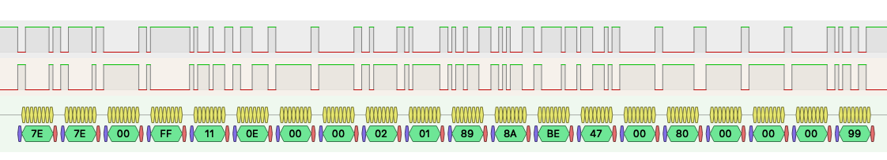

# Gree-Wired-Proto

## Overview
There are model of Gree AC that can be controller by XK19 Wired Controller or simmilar.
But there is not option to controll them wirelessly for home automation (except IR blasters).
The purpose of this repo is to describe protocol details between indoor unit and wired remote.

## Physical layer
The unit is connected with the remote using 4 wires: `GND`, `12V`, `A`, `B`.

`A` and `B` is a `RS-485` communication bus.

## Protocol

Serial communication settings used on the bus are 1200 baud, 8N1. 
The protocol can be described as follows:

```
<Header> <Src> <Dst> 11 <Body len> <Body>
```

| Byte | Message part |
| :---: | :--- |
| 0-1 | **Header** |
| 2 | **Src** |
| 3 | **Dst** |
| 4 | `11` |
| 5 | **Body len** |
| 6-* | **Body** |

The last byte of the **Body** is **CheckSum8 Xor** of the whole message.

The **Header** of any message is always `7E 7E`.

During line sniffing there were met two **Src**: `00` and `FF`; and three **Dst**: `00`, `FF` and `40`.

The byte `11` is always on it's place right between the **Dst** and **Body len**.

### Body len
| Src | Dst | Body len |
| :--- | :--- | :--- |
| `00` | `FF` | `0E` |
| `FF` | `00` | `15` |
| `FF` | `40` | `16` |

## Messages examples
| Header | Src | Dst | `11` | Body len | Body |
|:---|:---|:---|:---|:---|:---|
| `7E 7E` | `00` | `FF` | `11` | `0E` | `00 00 02 01 89 8A BE 47 00 80 00 00 00 99` |
| `7E 7E` | `FF` | `00` | `11` | `15` | `0C 30 83 01 14 7E 22 10 E0 E0 08 00 02 00 00 00 00 00 00 00 17` |
| `7E 7E` | `FF` | `40` | `11` | `16` | `0C 30 83 79 6C 00 00 00 00 04 00 08 00 00 00 00 00 00 00 00 19 07` |

According to theese samples it looks like that `FF` is the indoor unit, `00` is the wired remote (XK19 is my case) 
and the `40` is unknown (maybe centralized remote).
